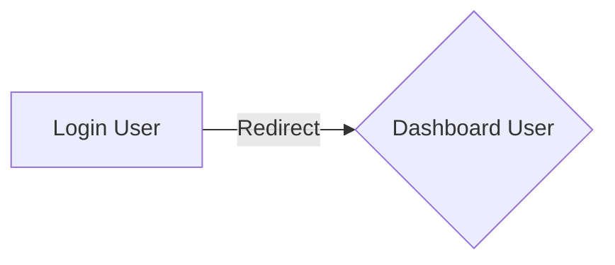
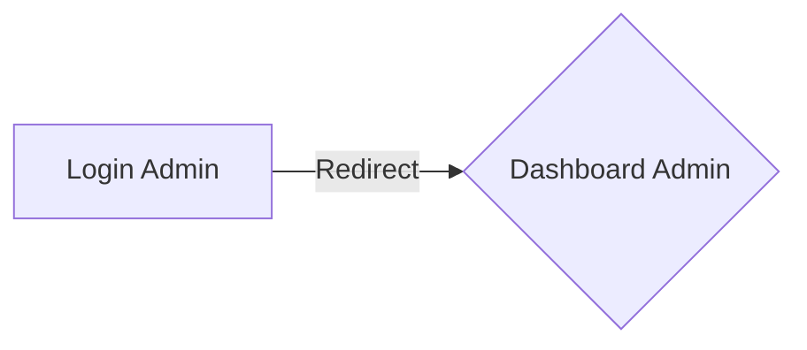

# Multi Autenticacion con Laravel 9

## Instalación

 - composer install
 - npm install
 - php artisan migrate
 
##### Desplegar el proyecto
 - npm run dev
 - php artisan serve

## Perfil Usuario

## Perfil Administrador

> **Luego:** Creación de perfiles por permisos y accesos.
